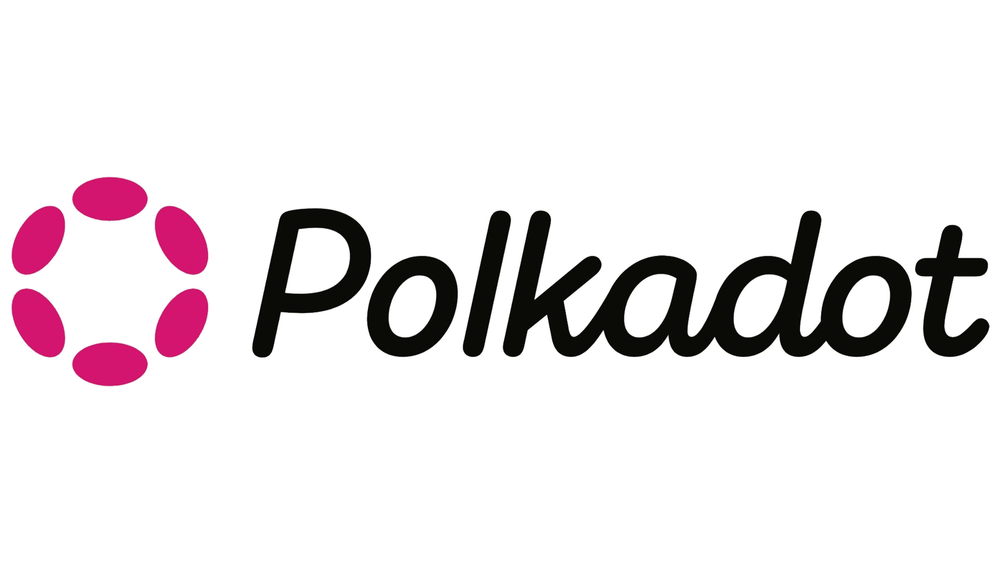

---
layout:
  width: wide
  title:
    visible: true
  description:
    visible: true
  tableOfContents:
    visible: true
  outline:
    visible: true
  pagination:
    visible: true
  metadata:
    visible: true
  tags:
    visible: true
---

# Introduction

Deep dives into Polkadot/Substrate internals with detailed code analysis and line-by-line explanations.

## Contents

| Document                                                                                               | Description                                                                                                                                                       |
| ------------------------------------------------------------------------------------------------------ | ----------------------------------------------------------------------------------------------------------------------------------------------------------------- |
| [Parachain Block Lifecycle](docs/parachain-block-lifecycle.md)                                         | Complete lifecycle of a block in a Substrate parachain — from collator slot claim through runtime execution, storage root calculation, and persistence to RocksDB |
| [Parachain Inherent Data and XCM Processing](docs/parachain-inherent-data-and-xcm-processing.md)       | How parachains receive data from the relay chain — fetching DMP/HRMP messages, state proof verification, and message queue processing                             |
| [XCM Message Execution Pipeline](docs/xcm-message-execution-pipeline.md)                               | How XCM messages execute during on\_idle — from pallet-message-queue through XcmExecutor instruction processing                                                   |
| [XCM Reserve Transfer Flow](docs/xcm-reserve-transfer-flow.md)                                         | Complete flow of reserve-backed asset transfers between parachains                                                                                                |
| [Collation Submission Pipeline](docs/collation-submission-pipeline.md)                                 | From candidate receipt construction through erasure coding, validator discovery, and PoV delivery                                                                 |
| [Origin Flow: pallet-collective to pallet-treasury](docs/origin-flow-pallet-collective-to-treasury.md) | How custom origins are created, wrapped into RuntimeOrigin, dispatched, and validated — the universal FRAME pattern                                               |
| [Transaction Pool Deep Dive](docs/transaction-pool-deep-dive.md)                                       | From RPC submission through validation, pool insertion with dependency resolution, and block inclusion                                                            |
| [Runtime WASM Injection Deep Dive](docs/runtime-wasm-injection-deep-dive.md)                           | How the runtime WASM travels from Rust source code to node execution — compilation, embedding, storage, and executor injection                                    |
| [Scale Codec and Runtime Metadata Deep Dive](docs/scale-codec-and-runtime-metadata-deep-dive.md)       | SCALE encoding/decoding internals and how runtime metadata is generated, exposed, and consumed by external tools                                                  |

## About

This repository documents the internal workings of Polkadot SDK components by tracing code paths end-to-end. Each document includes:

* Step-by-step flow explanations
* Code snippets from the actual `polkadot-sdk` repository
* File paths and line references
* Diagrams where helpful

## References

* [Polkadot SDK Repository](https://github.com/paritytech/polkadot-sdk)
* [Polkadot Wiki](https://wiki.polkadot.network/)
* [Substrate Documentation](https://docs.substrate.io/)

## License

MIT
